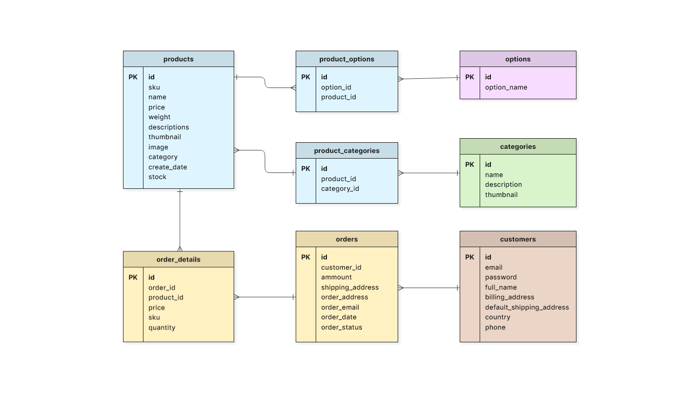

# Headings

**Bold**, *italic*, and ~~strikethrough~~

- [x] Completed

- [ ] Not completed
  
  | Feature | Supported |
  | ------- | --------- |
  | Tables  | Yes       |
  
  > [!WARNING]
  > This is a GitHub alert.
  > A footnote reference.[^1]
  > [^1]: Footnote text.

```csharp
public class Person
{
 public string Name { get; set; }
 public void SayHello()
 {
 Console.WriteLine($"Hello, {Name}");
 }
}
```



---

Database Diagram


---

## 📋 Topic 1: Timesheet Submission & Billing Process

**Speaker A:** I’m going to send you a spreadsheet for your timesheet. It’s based on the state’s form, but it includes a field where you log your daily activities. I’ll forward a copy of mine so you can see the kind of details I include—things like attending meetings, working on specific tasks, or providing developer support.

**Speaker A:** We submit these via email. You fill it out in Excel: place the date in the top-left corner, and it auto-populates the days of the week. You just enter your hours and mark whether you worked remotely or on-site. You’ll likely be marked as remote most of the time, since contracts are split between remote and on-site, and on-site work charges higher rates. For example, next week I’ll be on-site in Baton Rouge for three or four days for your team’s PI planning. Once it’s filled out, you just email it in.

---

# 🖖😐

# 🤷‍♂️

# ♋️
